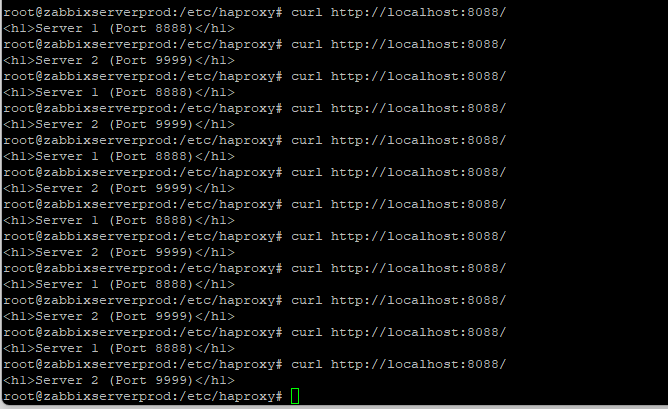
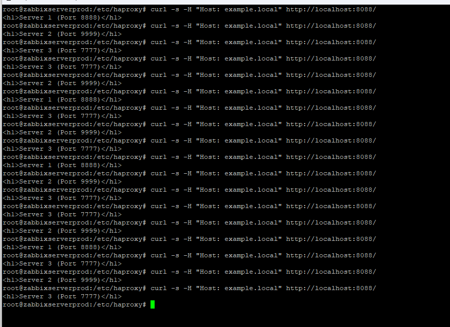
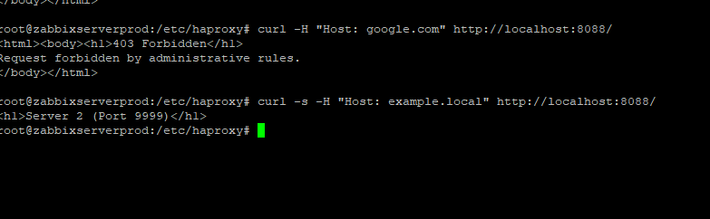

# Домашнее задание к занятию "`Кластеризация и балансировка нагрузки`" - `Манукян Степан`


---

### Задание 1

`Приведите ответ в свободной форме........`

1.`Запустите два simple python сервера на своей виртуальной машине на разных портах`
2.`Установите и настройте HAProxy, воспользуйтесь материалами к лекции по ссылке`
3.`Настройте балансировку Round-robin на 4 уровне.`
4.`На проверку направьте конфигурационный файл haproxy, скриншоты, где видно перенаправление запросов на разные серверы при обращении к HAProxy.`

`Решение


```
root@zabbixserverprod:/etc/haproxy# cat haproxy.cfg
global
        log /dev/log    local0
        log /dev/log    local1 notice
        chroot /var/lib/haproxy
        stats socket /run/haproxy/admin.sock mode 660 level admin expose-fd listeners
        stats timeout 30s
        user haproxy
        group haproxy
        daemon

        # Default SSL material locations
        ca-base /etc/ssl/certs
        crt-base /etc/ssl/private

        ssl-default-bind-ciphers ECDHE-ECDSA-AES128-GCM-SHA256:ECDHE-RSA-AES128-GCM-SHA256:ECDHE-ECDSA-AES256-GCM-SHA384:ECDHE-RSA-AES256-GCM-SHA384:ECDHE-ECDSA-CHACHA20-POLY1305:ECDHE-RSA-CHACHA20-POLY1305:DHE-RSA-AES128-GCM-SHA256:DHE-RSA-AES256-GCM-SHA384
        ssl-default-bind-ciphersuites TLS_AES_128_GCM_SHA256:TLS_AES_256_GCM_SHA384:TLS_CHACHA20_POLY1305_SHA256
        ssl-default-bind-options ssl-min-ver TLSv1.2 no-tls-tickets

defaults
        log     global
        mode    tcp          
        option  tcplog      
        option  dontlognull
        timeout connect 5000
        timeout client  50000
        timeout server  50000
        # errorfile 400 /etc/haproxy/errors/400.http
        # errorfile 403 /etc/haproxy/errors/403.http
        # errorfile 408 /etc/haproxy/errors/408.http
        # errorfile 500 /etc/haproxy/errors/500.http
        # errorfile 502 /etc/haproxy/errors/502.http
        # errorfile 503 /etc/haproxy/errors/503.http
        # errorfile 504 /etc/haproxy/errors/504.http

listen stats
        bind :880        
        mode http         
        stats enable
        stats uri /stats
        stats refresh 5s
        stats realm Haproxy\ Statistics

frontend example
        mode tcp          
        bind :8088
        default_backend web_servers

backend web_servers
        mode tcp        
        balance roundrobin
        server s1 127.0.0.1:8888 check
        server s2 127.0.0.1:9999 check
```
---

### Задание 2

`Приведите ответ в свободной форме........`

1. `Запустите три simple python сервера на своей виртуальной машине на разных портах.`
2. `Настройте балансировку Weighted Round Robin на 7 уровне, чтобы первый сервер имел вес 2, второй - 3, а третий - 4`
3. `HAproxy должен балансировать только тот http-трафик, который адресован домену example.local`
4. `На проверку направьте конфигурационный файл haproxy, скриншоты, где видно перенаправление запросов на разные серверы при обращении к HAProxy c использованием домена example.local и без него.`

`Решение
HAproxy  балансирует только тот http-трафик, который адресован домену example.local

без example.local

```
global
    log /dev/log local0
    log /dev/log local1 notice
    chroot /var/lib/haproxy
    stats socket /run/haproxy/admin.sock mode 660 level admin expose-fd listeners
    stats timeout 30s
    user haproxy
    group haproxy
    daemon

defaults
    log global
    mode http
    option httplog
    option dontlognull
    timeout connect 5000
    timeout client 50000
    timeout server 50000

# Статистика HAProxy
listen stats
    bind :888
    mode http
    stats enable
    stats uri /stats
    stats refresh 5s


frontend http_front
    mode http
    bind :8088

    # Проверяем Host-заголовок
    acl is_example_local hdr(host) -i example.local

    # Только для example.local
    use_backend weighted_servers if is_example_local

    # Для всех остальных доменов — заглушка
    default_backend no_access

# Бэкенд с Weighted Round Robin
backend weighted_servers
    mode http
    balance roundrobin
    # Веса: сервер 1 — вес 2, сервер 2 — вес 3, сервер 3 — вес 4
    server s1 127.0.0.1:8888 weight 2 check
    server s2 127.0.0.1:9999 weight 3 check
    server s3 127.0.0.1:7777 weight 4 check


backend no_access
    mode http
    http-request deny deny_status 403
    errorfile 403 /etc/haproxy/errors/403.http
root@zabbixserverprod:/etc/haproxy#

```
